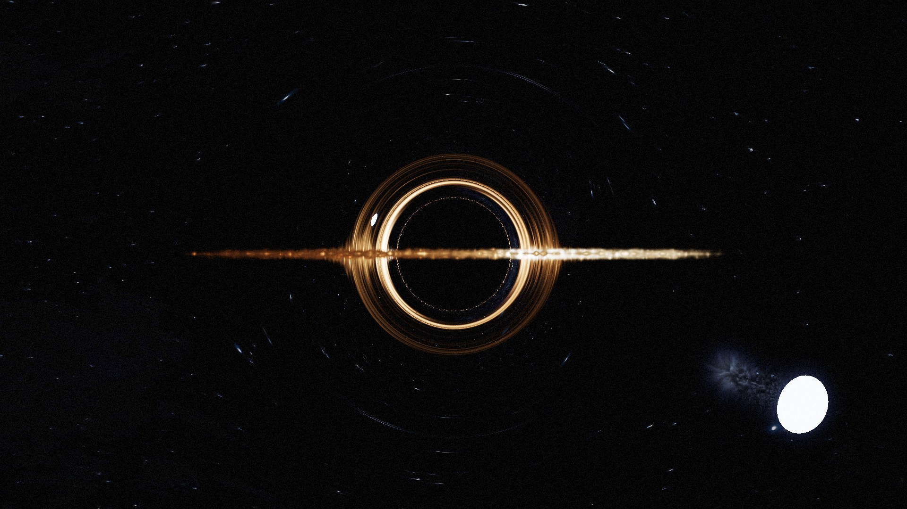

# Gargantua: A Cinematic Black Hole Renderer in Taichi

  

A real-time, cinematic renderer for a gravitationally-lensed black hole, inspired by the movie *Interstellar*. This project is built entirely in Python using the [Taichi programming language](https://www.taichi-lang.org/) to achieve high performance on the GPU.

It combines a general relativistic ray tracer with a dynamic, volumetric 3D fluid simulation for the accretion disk, and a suite of post-processing effects to create a stunning and scientifically-grounded visual.

## Features

-   **General Relativistic Ray Tracing:** Simulates the path of light through the curved spacetime of a Schwarzschild black hole, accurately producing the iconic gravitational lensing effect.
-   **Dynamic 3D Accretion Disk:** The accretion disk is not a static texture. It's a full 3D gas volume simulated in real-time using a grid-based fluid solver, including forces like gravity and orbital mechanics.
-   **Volumetric Rendering:** The accretion disk is rendered as a true volume, with properties like emission, absorption, and scattering calculated as rays march through the gas.
-   **Advanced Lighting & Shading:**
    -   **Doppler Beaming:** Simulates the relativistic Doppler effect (redshift and blueshift) on the accretion disk, making the side spinning towards the camera appear brighter and bluer.
    -   **Henyey-Greenstein Scattering:** Implements a realistic phase function for how light scatters within the gas volume.
    -   **Procedural Stars:** The two suns feature procedurally generated surfaces using FBM noise, giving them a dynamic, fiery appearance.
-   **Cinematic Post-Processing Suite:**
    -   ACES Tone Mapping for film-like color grading.
    -   Bloom and Anamorphic Lens Flares for dramatic lighting.
    -   Vignette and Film Grain to enhance the cinematic feel.
-   **GPU-Accelerated:** Leverages the Taichi compiler to JIT-compile Python code to high-performance CUDA kernels for real-time interaction and rendering.

## Technical Deep Dive

The renderer's heart is a ray tracer that solves the geodesic equations of light in curved spacetime. Instead of tracing straight lines, it uses a **Dormand-Prince 5(4) adaptive integrator** to accurately calculate the bent path of each light ray near the black hole's massive gravitational field.

The iconic accretion disk is a **3D Eulerian fluid simulation** running on a grid. Each frame, the simulation advects the gas density and velocity, applies gravitational and orbital forces, and projects the velocity field to ensure the fluid remains incompressible. This dynamic volume is then rendered using **volumetric ray marching**, where the color and transmittance are integrated along each segment of the lensed ray path.

## Some Quick Notes

- I used ChatGPT for assisting in documenting, commenting, and standardizing the final codebase presented here, as well as for crafting cinematic effects.

- There are several other optimizations possible, and I am well aware of them. However, I'm currently done with this project. That said, I'm open to any contributions if you'd like to take it further.

