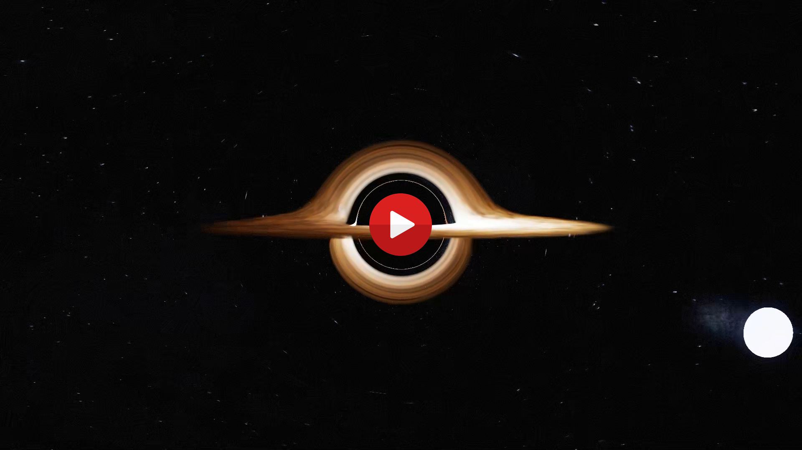

# Gargantua: A Cinematic Black Hole Renderer in Taichi

  

A real-time, cinematic renderer for a gravitationally-lensed black hole, inspired by the movie *Interstellar*. This project is built entirely in Python using the [Taichi programming language](https://www.taichi-lang.org/) to achieve high performance on the GPU.

It combines a general relativistic ray tracer with a dynamic, volumetric 3D fluid simulation for the accretion disk, and a suite of post-processing effects to create a stunning and scientifically-grounded visual.

## Features

-   **General Relativistic Ray Tracing:** Simulates the path of light through the curved spacetime of a Schwarzschild black hole using a **Dormand-Prince 5(4) adaptive integrator** to accurately produce the iconic gravitational lensing effect.
-   **Dynamic 3D Accretion Disk on a Cylindrical Grid:** The accretion disk is not a static texture. It's a full 3D gas volume simulated in real-time. The simulation runs on a custom **cylindrical coordinate grid (radius, theta, height)**, which is vastly more efficient and detailed for a disk-like structure than a standard Cartesian grid.
-   **Volumetric Rendering:** The accretion disk is rendered as a true volume, with properties like emission, absorption, and scattering calculated as rays march through the gas.
-   **Advanced Lighting & Shading:**
    -   **Doppler Beaming:** Simulates the relativistic Doppler effect (redshift and blueshift) on the accretion disk, making the side spinning towards the camera appear brighter and bluer.
    -   **Henyey-Greenstein Scattering:** Implements a realistic phase function for how light scatters within the gas volume.
    -   **Procedural Stars:** The two suns feature procedurally generated surfaces using FBM noise, giving them a dynamic, fiery appearance.
-   **Cinematic Post-Processing Suite:**
    -   ACES Tone Mapping for film-like color grading.
    -   Bloom and Anamorphic Lens Flares for dramatic lighting.
    -   Vignette and Film Grain to enhance the cinematic feel.
-   **Intelligent Frame Caching:** Avoids re-rendering identical frames by generating a unique hash based on all simulation and camera parameters. Cached frames are saved to disk and reloaded instantly, ideal for iterating on camera paths.
-   **Enhanced User Experience:** Includes `rich` terminal output for clarity, a `tqdm` progress bar for offline rendering, and real-time system monitoring (CPU/RAM/VRAM) to track performance.
-   **GPU-Accelerated:** Leverages the Taichi compiler to JIT-compile Python code to high-performance CUDA kernels for real-time interaction and rendering.

## Technical Deep Dive

The renderer's heart is a ray tracer that solves the geodesic equations of light in curved spacetime. Instead of tracing straight lines, it uses a **Dormand-Prince 5(4) adaptive integrator** to accurately calculate the bent path of each light ray near the black hole's massive gravitational field.

The iconic accretion disk is a **3D Eulerian fluid simulation** that has been fundamentally re-architected for this project. Instead of running on a generic Cartesian (cubic) grid, the simulation now operates on a **custom cylindrical coordinate grid (radius, theta, height)**. This coordinate system is naturally aligned with the disk's geometry, which avoids wasting computation on empty space far from the disk and allows for much higher effective resolution where it matters.

Each frame, the simulation advects the gas density and velocity, applies forces like gravity and orbital mechanics in the cylindrical space, and projects the velocity field using a Jacobi solver to ensure the fluid remains incompressible. This dynamic volume is then rendered using **volumetric ray marching**, where the color and transmittance are integrated along each segment of the lensed ray path.

## Some Quick Notes

-   I used ChatGPT for assisting in documenting, commenting, and standardizing the final codebase presented here, as well as for crafting cinematic effects.
-   There are several other optimizations possible, and I am well aware of them. However, I'm currently done with this project. That said, I'm open to any contributions if you'd like to take it further.

## Future Work & Potential Optimizations

The fluid simulation is built on a robust grid-based solver, but several advanced techniques could be implemented to further improve both its performance and visual fidelity. To the best of my knowledge, the following are standard optimization approaches. Please feel free to suggest additional ones if applicable.

| Optimization                | Benefit                                                                                                                                                                                                                                                                                                                                                              |
| :-------------------------- | :------------------------------------------------------------------------------------------------------------------------------------------------------------------------------------------------------------------------------------------------------------------------------------------------------------------------------------------------------------------- |
| **Accelerated Pressure Solver** | The iterative Jacobi solver for pressure projection is simple but converges slowly. Replacing it with a [Conjugate Gradient (CG) method](https://www.cs.cmu.edu/~quake-papers/painless-conjugate-gradient.pdf) would offer dramatically faster convergence, significantly reducing the time spent on the most computationally expensive part of the simulation. For the highest performance, a [Multigrid approach](https://arxiv.org/pdf/2205.09411) could be used, which is often an order of magnitude faster. Also [this paper](https://arxiv.org/abs/2505.13390v1) looks very interesting. |
| **Sparse Grid Data Structures** | While the cylindrical grid is far more efficient than a Cartesian one, a significant portion of the simulation domain can still be empty (e.g., gaps in the disk). Using a sparse volumetric data structure would allow the simulation to allocate memory and perform computations only in regions that actually contain gas, drastically reducing memory footprint and computational cost.                                                                                                |

## Star History

<a href="https://www.star-history.com/#amirh0ss3in/Gargantua&Date">
 <picture>
   <source media="(prefers-color-scheme: dark)" srcset="https://api.star-history.com/svg?repos=amirh0ss3in/Gargantua&type=Date&theme=dark" />
   <source media="(prefers-color-scheme: light)" srcset="https://api.star-history.com/svg?repos=amirh0ss3in/Gargantua&type=Date" />
   
 </picture>
</a>